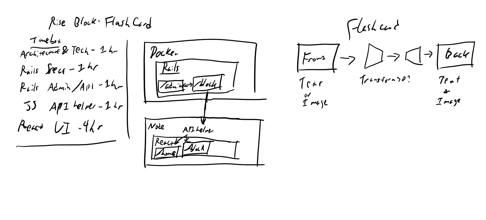

# Flip Block POC
## Startup
Clone the repository

Start the Docker container and create, migrate, and seed the database.
```
cd art_poc_rails
docker-compose up -d
docker-compose exec app rake db:create db:migrate db:seed
```
Visit localhost:3000/admin for block admin, localhost:3000/blocks for blocks in json format.

Start the yarn application
```
cd art_poc_react
yarn start
```
Visit localhost:3001 for the frontend.

## Overview
First, take a look at the whiteboard diagram, which provides a rough outline of estimated times and some design diagrams.


Next, feel free to review the design doc [here](https://github.com/byrdsd/art_poc/issues/1), as it outlines the tech design and the approach.

Started out with some simple models and tests to lay out the basic interface, but spent more time than I care to admit on configuration issues with Docker. Also had a false start trying to use react-rails, which backfired on me and caused more trouble than it helped due to some differences in the way it functions as opposed to client-side react, which led to rolling that attempt back and leaning on erb for the admin interface.

When planning the project I estimated a little backwards; I expected to spend the most time on the react frontend, but found myself spending more time on the backend. The frontend, by contrast, was quite smooth and straightforward. There were a lot of typical Rails configurations that go into new projects that tripped me up, since I spend most of my time in Rails on existing repositories. After working through it, I believe I'd be able to do it again in a fraction of the time.

## Caveats
I'd like to implement more testing; what's there is very barebones currently. That said, for a POC, I wouldn't typically expect to see huge test coverage to begin with, mostly around requests and models. I would expect to see it ramp up as a project moved into a prototyping phase.
